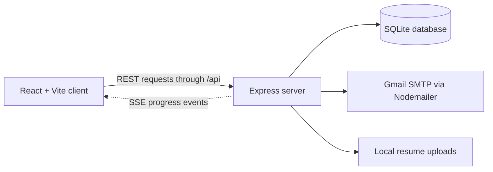

<div align="center">

# EmailPro

### A local-first dashboard for managing and sending personalized outreach emails

Manage contacts, build reusable HTML templates, send Gmail messages with configurable delays, and review delivery history from one full-stack application.


</div>

> [!IMPORTANT]
> This project sends real email through the configured Gmail account. Test with your own address first, respect recipient consent and provider policies, and keep the application private unless authentication and access controls are added.

## Overview

EmailPro is a React and Express application for running small, personalized email campaigns from a local machine. The frontend provides the campaign workflow; the backend stores data in SQLite, sends mail through Gmail with Nodemailer, and streams live progress to the browser with Server-Sent Events (SSE).

| Area | Capabilities |
| --- | --- |
| Dashboard | Recruiter and delivery totals, recent activity, and quick actions |
| Recruiters | Search, create, edit, delete, import from CSV, and export to CSV |
| Templates | Create HTML templates, preview content, and select a default template |
| Sending | Send to selected or previously uncontacted recruiters with live progress |
| History | Filter and paginate sent, failed, and pending email records |
| Analytics | Delivery timeline, status breakdown, and template usage charts |
| Settings | Configure sender name, delay, and the PDF resume attachment |
| Appearance | Responsive interface with light and dark themes |

## Architecture



The Vite development server runs on `http://localhost:5173` and proxies `/api` requests to the Express server on `http://localhost:8000`.

## Project structure

```text
email-automation-tool/
|-- client/                     # React frontend
|   |-- public/                 # Static assets
|   |-- src/
|   |   |-- components/         # Reusable UI components
|   |   |-- pages/              # Application screens
|   |   |-- styles/             # Page-specific styles
|   |   `-- App.jsx             # Routes and application shell
|   |-- package.json
|   `-- vite.config.js          # Development API proxy
|-- server/                     # Express backend
|   |-- routes/                 # REST and SSE endpoints
|   |-- services/               # Email delivery service
|   |-- uploads/                # Resume attachments
|   |-- data.db                 # Local SQLite data
|   |-- db.js                   # Schema and default seed data
|   |-- server.js               # Server entry point
|   `-- package.json
`-- ReadMe.md
```

## Prerequisites

- Node.js `20.19+` or `22.12+`
- npm
- A Gmail account with 2-Step Verification enabled
- A Gmail App Password for SMTP authentication

## Quick start

### 1. Clone the repository

```bash
git clone https://github.com/AradhyaMalaviya/email-automation-tool.git
cd email-automation-tool
```

### 2. Configure and start the backend

```bash
cd server
npm ci
```

Create `server/.env`:

```env
Email=your.address@gmail.com
EMAIL_PASS=your_16_character_app_password
```

Use a Gmail App Password, not the password used to sign in to your Google account. The `.env` file is ignored by Git and must remain private.

Start the API:

```bash
npm run dev
```

The backend starts on `http://localhost:8000`.

### 3. Start the frontend

Open a second terminal from the repository root:

```bash
cd client
npm ci
npm run dev
```

Open `http://localhost:5173`.

## First campaign

1. Open **Settings**, set the sender name and delay, and upload a PDF resume if required.
2. Open **Templates** and create or select a default email template.
3. Add contacts under **Recruiters**, either manually or from a CSV file.
4. Open **Send Emails**, select recipients, review the preview, and start the job.
5. Monitor the live send log, then review **History** and **Analytics**.

### CSV format

CSV imports require `Name`, `Company`, and `Email` columns. Header matching is case-insensitive.

```csv
Name,Company,Email
Jane Doe,Acme Labs,jane.doe@example.com
John Smith,Northstar Inc,john.smith@example.com
```

Duplicate email addresses are skipped because recruiter email addresses are unique in the database.

### Template variables

Variables can be used in both the subject and HTML body:

| Variable | Replaced with |
| --- | --- |
| `{name}` | Recruiter's name |
| `{company}` | Recruiter's company |

Variable matching is case-insensitive during delivery.

## Configuration

| Setting | Location | Default | Purpose |
| --- | --- | --- | --- |
| `Email` | `server/.env` | Required | Gmail address used to send messages |
| `EMAIL_PASS` | `server/.env` | Required | Gmail App Password |
| Sender name | Settings page | `Aaradhya Malaviya` | Display name in the From header |
| Sending delay | Settings page | `60000` ms | Wait time between recipients |
| Resume | Settings page | Seeded local filename | Optional PDF attached to outgoing mail |

The backend port is currently fixed at `8000` in `server/server.js`.

## Available scripts

Run scripts from their respective directories.

| Directory | Command | Purpose |
| --- | --- | --- |
| `client` | `npm run dev` | Start the Vite development server |
| `client` | `npm run build` | Create a production build in `client/dist` |
| `client` | `npm run lint` | Run ESLint |
| `client` | `npm run preview` | Preview the production frontend build |
| `server` | `npm run dev` | Start the Express server |

## API summary

| Method and path | Description |
| --- | --- |
| `GET /api/recruiters` | List or search recruiters |
| `POST /api/recruiters` | Create a recruiter |
| `POST /api/recruiters/import` | Import a CSV file |
| `GET /api/recruiters/export` | Export recruiters as CSV |
| `GET /api/templates` | List email templates |
| `POST /api/templates` | Create a template |
| `POST /api/emails/send` | Start a background send job |
| `GET /api/emails/progress` | Stream job progress over SSE |
| `GET /api/emails/history` | Return paginated delivery history |
| `GET /api/emails/stats` | Return dashboard totals |
| `GET /api/analytics` | Return chart data |
| `GET /api/settings` | Return application settings |
| `PUT /api/settings` | Update application settings |
| `POST /api/settings/resume` | Upload a resume PDF |

## Production mode

Build the frontend first:

```bash
cd client
npm ci
npm run build
```

When `NODE_ENV=production`, the Express server serves `client/dist` in addition to the API. Start it from `server/` after setting the environment variable for your shell.

PowerShell:

```powershell
$env:NODE_ENV = "production"
npm run dev
```

macOS or Linux:

```bash
NODE_ENV=production npm run dev
```

## Security and data handling

- This application has no user authentication and is intended for trusted, local use.
- Do not expose port `8000` directly to the public internet without authentication, authorization, input validation, and restricted CORS configuration.
- Never commit `server/.env` or SMTP credentials.
- Treat `server/data.db`, uploaded resumes, CSV exports, and email logs as private data. Remove them from Git history before making a repository public if they contain real information.
- A sending delay reduces message frequency but does not guarantee deliverability or prevent spam classification.
- Review Gmail sending limits and anti-spam policies before running a campaign.

## Troubleshooting

<details>
<summary><strong>The frontend cannot reach the API</strong></summary>

Confirm the Express server is running on port `8000`. The development proxy in `client/vite.config.js` forwards `/api` requests to that port.

</details>

<details>
<summary><strong>Gmail rejects the login</strong></summary>

Confirm that 2-Step Verification is enabled and `EMAIL_PASS` contains an App Password rather than your normal Gmail password. Restart the server after changing `.env`.

</details>

<details>
<summary><strong>No resume is attached</strong></summary>

Upload a PDF from **Settings** and confirm the displayed filename. The backend checks `server/uploads/` first and then the `server/` directory.

</details>

<details>
<summary><strong>Some recipients are skipped during CSV import</strong></summary>

Verify every row contains name, company, and email values. Existing email addresses are intentionally skipped as duplicates.

</details>

## Author

**Aaradhya Malaviya**<br>
AI-Powered Product Builder

- [GitHub](https://github.com/AradhyaMalaviya)
- [LinkedIn](https://www.linkedin.com/in/aradhya-malaviya-26bb31303/)

---

<div align="center">
Built with React, Express, SQLite, and Nodemailer.
</div>
